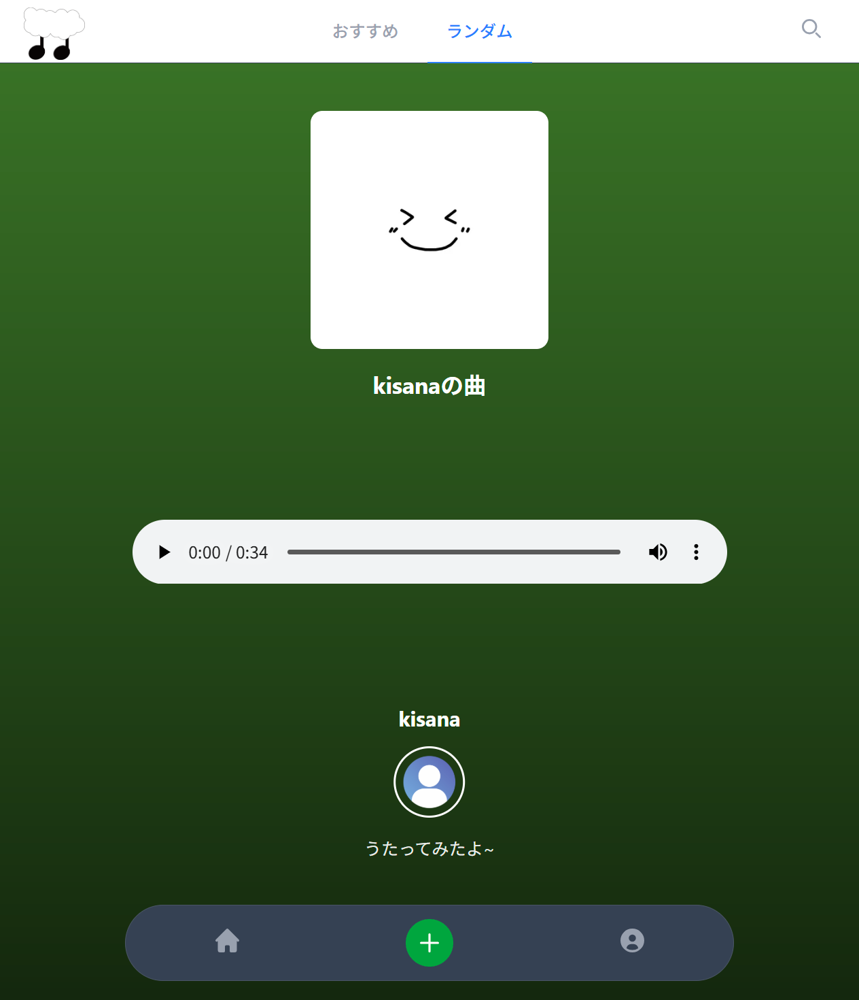
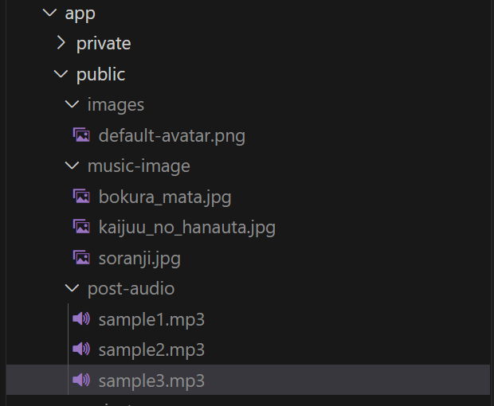

# しっくりボーカル

株式会社セレスの渋谷サクラステージSHIBUYAタワーオフィスで、8/6~9の3日間ハッカソン型インターンシップが開催されました。

私はチームBに配属され、メンバー3人と共同開発しました。

ランダムシナリオからシーンを選び、ブレインストーミング、親和図法を経てテーマを決めビジネスモデルキャンバスを作成し、自分の「しっくりくる」歌声の推しを探すことができるサービスを作成しました。



## 開始

開始準備として、/src/storage/appに初期ファイルを置いておくとよいでしょう(任意)



下記コマンドでサーバーが開始します

```
docker compose -f 'compose.yaml' up -d --build
```

サービスを開くには[http://localhost:8000/](http://localhost:8000/)にアクセスします

## 管理

コンソールに入るには

```
docker compose run --build --rm app bash
```

サーバーログを確認するには

```
docker exec -it ???-app-1 bash
```

'???'にはディレクトリ名を入れてください
